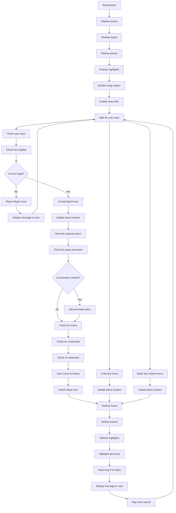

# Work FLow

```mermaid
flowchart TD

%% Initialization
A[Reset board] --> B[Initialize pieces]
B --> C[Redraw board]
C --> D[Redraw pieces]
D --> E[Redraw highlights]
E --> F[Enable resign option]
F --> G[Enable draw offer]
G --> H[Wait for user input]

%% Input & validation
H --> I[Parse user input]
I --> J[Check turn legality]
J --> K{Is move legal?}

K -- No --> L[Reject illegal move]
L --> M[Display message to user]
M --> H

K -- Yes --> N[Accept legal move]

%% Move execution
N --> O[Update piece location]
O --> P[Remove captured piece]
P --> Q[Check for pawn promotion]

Q --> R{Is promotion needed?}
R -- Yes --> S[Add promoted piece]
R -- No --> T[Check for check]

%% Game state checks
S --> T
T --> U[Check for checkmate]
U --> V[Check for stalemate]
V --> W[Save move to history]
W --> X[Switch player turn]

%% UI updates
X --> Y[Redraw board]
Y --> Z[Redraw pieces]
Z --> AA[Redraw highlights]
AA --> AB[Highlight last move]
AB --> AC[Flash king if in check]
AC --> AD[Display message to user]
AD --> AE[Play move sound]

%% Loop back
AE --> H

%% Undo/Redo options (external triggers)
H --> AF[Undo last move]
AF --> AG[Update piece location]
AG --> Y

H --> AH[Redo last undone move]
AH --> AI[Update piece location]
AI --> Y
```
